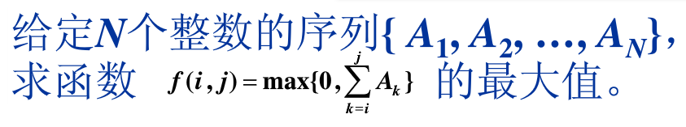
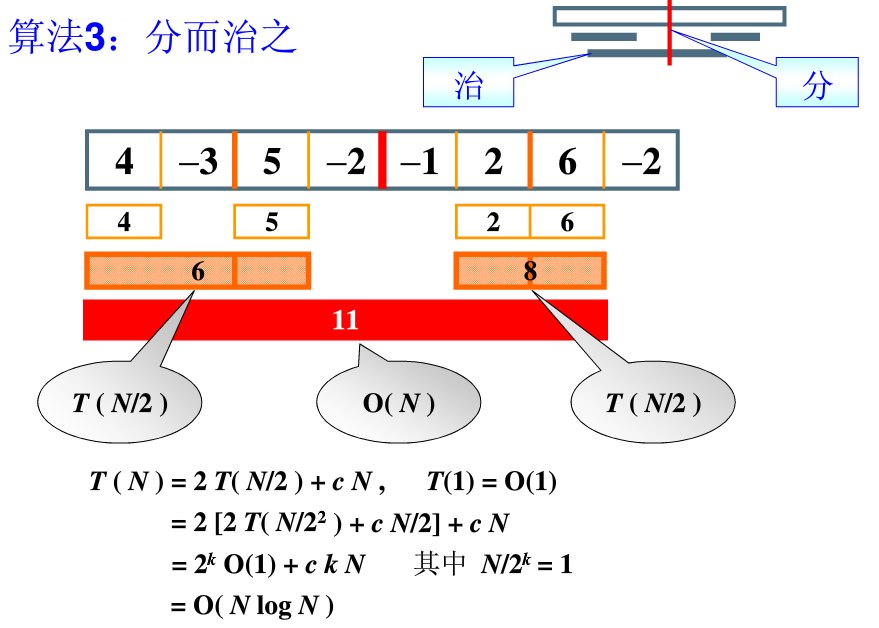

## 最大连续子列和问题
问题描述：



## 算法1

暴力求解。
```java
int MaxSubseqSum1(int A[], int N){
	int ThisSum, MaxSum = 0;
	int i, j, k;
	for(i=0;i<N;i++){		//i是子列左端位置
		for(j=i;j<N;j++){		//j是子列右端位置
			ThisSum = 0;		//ThisSum是从A[i]到A[j]的子列和
			for(k=i;k<=j;k++)
				ThisSum += A[k];
			if (ThisSum > MaxSum) {		//如果刚得到的这个子列和更大，则更新结果
				MaxSum = ThisSum;
			}
		}
	}
	return MaxSum;
}
```

**T(N)=O(N³)**

## 算法2
```java
int MaxSubseqSum2(int A[], int N){
	int ThisSum, MaxSum = 0;
	int i, j;
	for(i=0;i<N;i++){		//i是子列左端位置
		ThisSum = 0;		//ThisSum是从A[i]到A[j]的子列和
		for(j=i;j<N;j++){		//j是子列右端位置		
			ThisSum += A[j];
			//对于相同的i，不同的j，只要在j-1次循环的基础上累加1项即可
			if (ThisSum > MaxSum) {		//如果刚得到的这个子列和更大，则更新结果
				MaxSum = ThisSum;
			}
		}
	}
	return MaxSum;
}
```

**T(N)=O(N²)**

## 算法3

分而治之。



