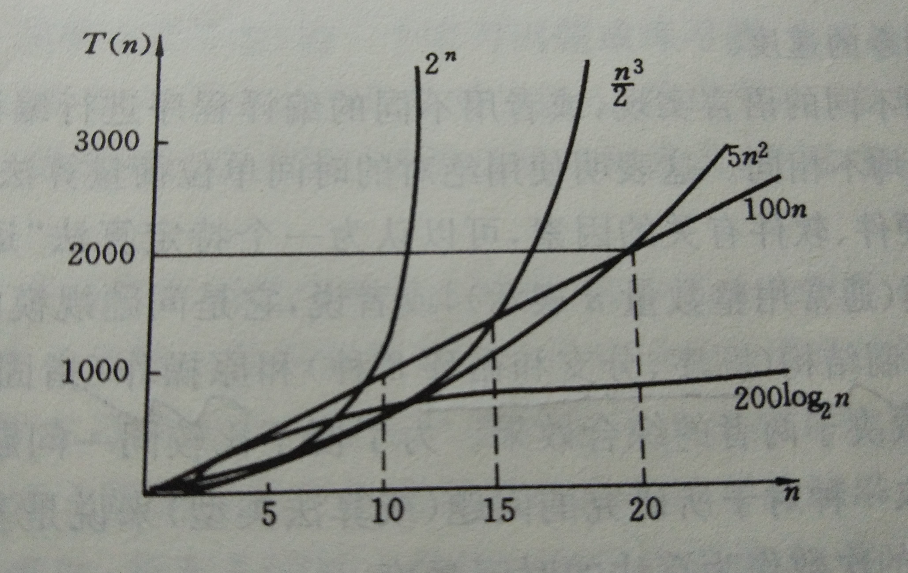

## 总述

算法复杂度分为时间复杂度和空间复杂度。时间复杂度是指执行这个算法所需要的耗费时间的长度；而空间复杂度是指执行这个算法所需要的内存空间，需要占用存储单元的长度。

## 时间复杂度

```java
for(i=1;i<=n;++i){
    for(j=1;j<=n;++j){
        c[i][j]=0;
        for(k=1;k<=n;++k){
            c[i][j]+=a[i][k]*b[k][j];
        }
    }
}
```

在上面所示的两个N×N矩阵相乘的算法中，“乘法”运算是“矩阵相乘问题”的基本操作。整个算法的执行时间与该基本操作（乘法）重复执行的次数 n³ 成正比，记作 **T(n)=O(n³)**。

一般情况下，算法中基本操作重复执行的次数是问题规模n的某个函数f(n)，算法的时间量度记作 **T(n)=O(f(n))** 。它表示随问题规模n的增大，算法执行时间的增长率和f(n)的增长率相同，称作算法的渐近时间复杂度（asymptotic time complexity），简称时间复杂度。

显然，多数情况下原操作应该是最深层循环内的语句中的原操作，它的执行次数和包含它的语句的频度相同。语句的频度是指该语句重复执行的次数。



**O(1)<O(log₂n)<O(n)<O(n²)<O(n³)<O(2ⁿ)**

由于算法的时间复杂度考虑的只是对于问题规模n的增长率，则难以精确计算基本操作执行次数（或语句频度)的情况下，只需求出它关于n的增长率或阶即可。比如下面的程序中：
```
for(i=2;i<n;++i)
    for(j=2;j<=i-1;++j){++x;a[i][j]=x;}
```
语句++x的执行次数关于n的增长率为n²，它是语句频度表达式(n-1)(n-2)/2中增长最快的项。

## 空间复杂度

空间复杂度（space complexity）记作：S(n)=O(f(n))

若额外空间相对于输入数据量来说是常数，则称次算法为原地工作。