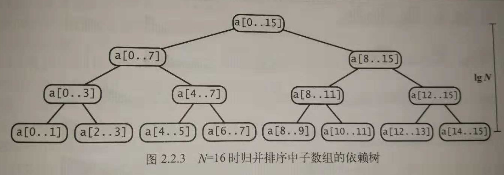

## 总述

归并排序（MERGE-SORT）是建立在归并操作上的一种有效的排序算法,该算法是采用分治法（Divide and Conquer）的一个非常典型的应用。将已有序的子序列合并，得到完全有序的序列；即先使每个子序列有序，再使子序列段间有序。若将两个有序表合并成一个有序表，称为二路归并。

归并排序能保证将任意长度为N的数组排序所需要时间和 NlogN 成正比；它的主要缺点是它所需要的额外空间和 N 成正比。

简单的归并排序示意图如下：

&nbsp;&nbsp;&nbsp;&nbsp;&nbsp;输入&nbsp;&nbsp;M E R G E S O R T E X A M P L E

将左半部分排序&nbsp;&nbsp;E E G M O R R S|T E X A M P L E

将右半部分排序&nbsp;&nbsp;E E G M O R R S|A E E L M P T X

&nbsp;&nbsp;&nbsp;归并结果&nbsp;&nbsp;A E E E E G L M M O P R R S T X

## 原地归并的抽象方法

直接了当，将两个不同的有序数组归并到第三个数组中，两个数组中的元素都应该实现了COmparable接口。

方法merge(a, lo, mid, hi)，它会将子数组a[lo..mid]和a[mid+1..hi]归并成一个有序的数组并将结果存放在a[lo..hi]中。

```java
//原地归并的抽象方法
//将a[lo..mid]和a[mid+1..hi]归并
public static void merge(Comparable[] a, int lo, int mid, int hi){

	int i = lo, j = mid+1;

	for(int k = lo; k <= hi; k++){		//将a[lo..hi]复制到aux[lo..hi]
		aux[k] = a[k];
	}

	for(int k = lo; k <= hi; k++){
		if(i > mid)
			a[k] = aux[j++];
		else if(j > hi)
			a[k] = aux[i++];
		else if(less(aux[j], aux[i]))
			a[k] = aux[j++];
		else
			a[k] = aux[i++];
	}
}
```

该方法先将所有元素复制到aux[]中，然后再归并回a[]中。方法在归并时（第二个for循环）进行了4个条件判断：左半边用尽（取右半边的元素）、右半边用尽（取左半边的元素）、右半边的当前元素小于左半边的当前元素（取右半边的元素）以及右半边的当前元素大于等于左边的当前元素（取左半边的元素）。

## 自顶向下的归并排序

基于原地归并的抽象方法实现了另一种递归归并，也是应用分治思想的最典型的一个例子。

如果算法能够将两个子数组排序，它就能够通过归并两个子数组来将整个数组排序。

```java
//自顶向下的归并排序
public class Merge{
	private static Comparable[] aux;		//归并所需的辅助数组

	public static void sort(Comparable[] a){
		aux = new Comparable[a.length];		//一次性分配空间
		sort(a, 0, a.length-1);
	}

	private static void sort(Comparable[] a. int lo, int hi){
		//将数组a[lo..hi]排序
		if(hi <= ho)
			return;
		int mid = lo + (hi - lo)/2;
		sort(a, lo, mid);		//将左半边排序
		sort(a, mid+1, hi);		//将右半边排序
		merge(a, lo, mid, hi);		//归并结果
	}
}
```



这棵树正好有n层。对于0到n-1之间的任意k，自顶向下的第k层有（2^k）个子数组，每个数组的长度为 2^(n-k) ，归并最多需要 2^(n-k) 次比较。因此每层的比较次数为 2^k * 2^(n-k) = 2^n ，n层总共为 n*2^n=NlgN 。

**对于长度为N的任意数组，自顶向下的归并排序需要``½NlgN``至``NlgN``次比较。**

**对于长度为N的任意数组，自顶向下的归并排序最多需要访问数组``6NlgN``次。**