## 二分查找
```java
int BinarySearch(StaticTable *Tbl, ElementType K){
	//在表Tbl中查找关键字为K的数据元素
	int left,right,mid,NoFound=-1;

	left = 1;		//初始左边界
	right = Tbl->Length;		//初始右边界
	while(left<=right){
		mid = (left+right)/2;
		if(K<Tbl->Element[mid])
			right = mid-1;		//调整右边界
		else if(K>Tbl->Element[mid])
			left = mid+1;		//调整左边界
		else
			return mid;		//查找成功，返回数据元素下标
	}
	return NoFound;		//查找不成功，返回-1
}
```

**二分查找时间复杂度为 O(logN)**

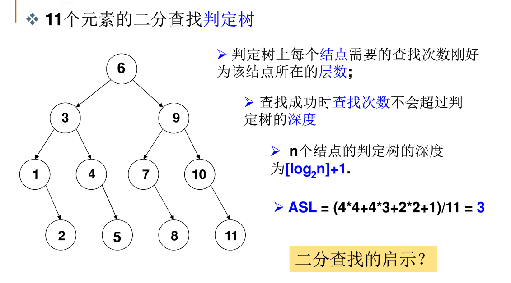

## 树的基本术语

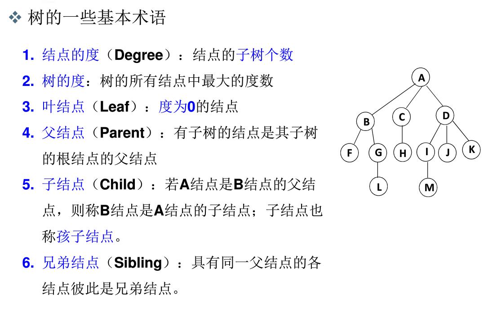

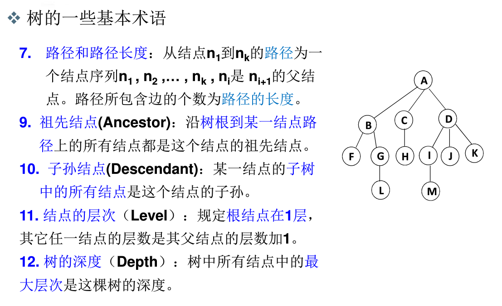

## 树的表示

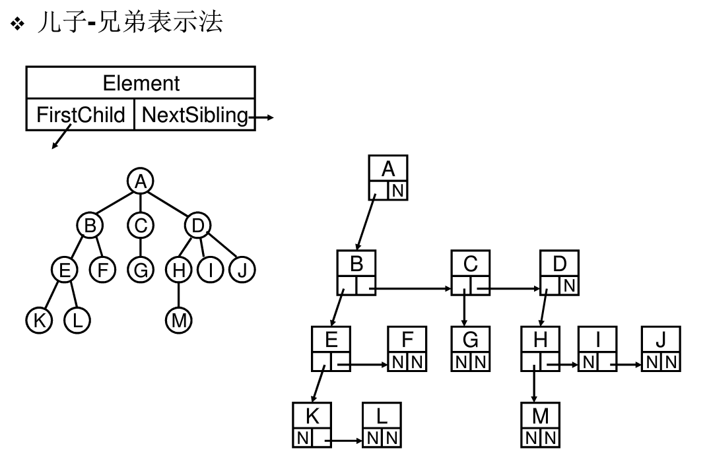

## 二叉树

最重要，最主要的内容。

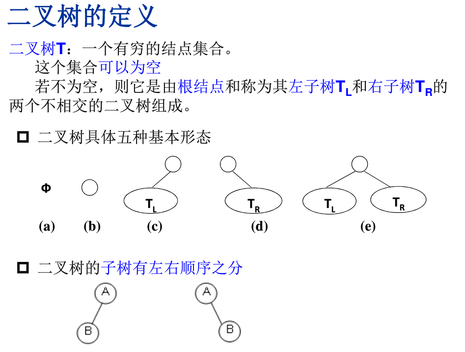

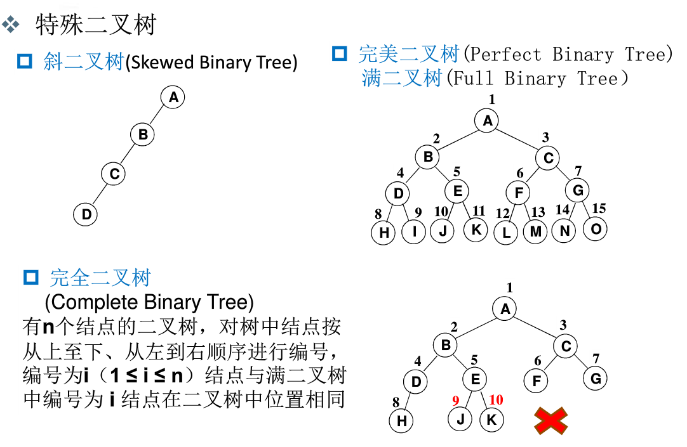

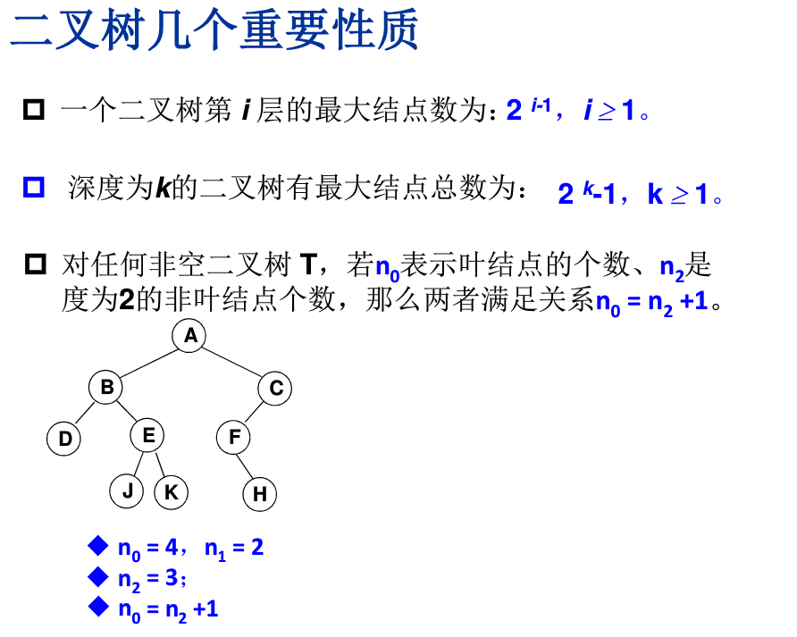

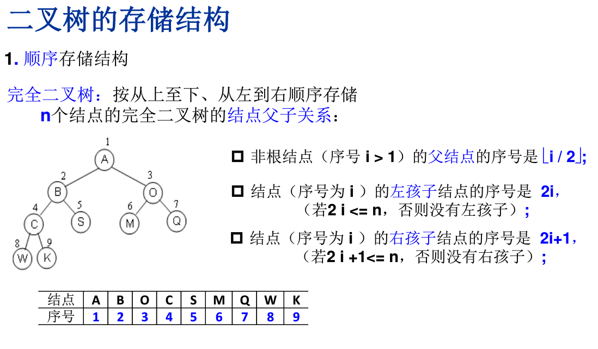

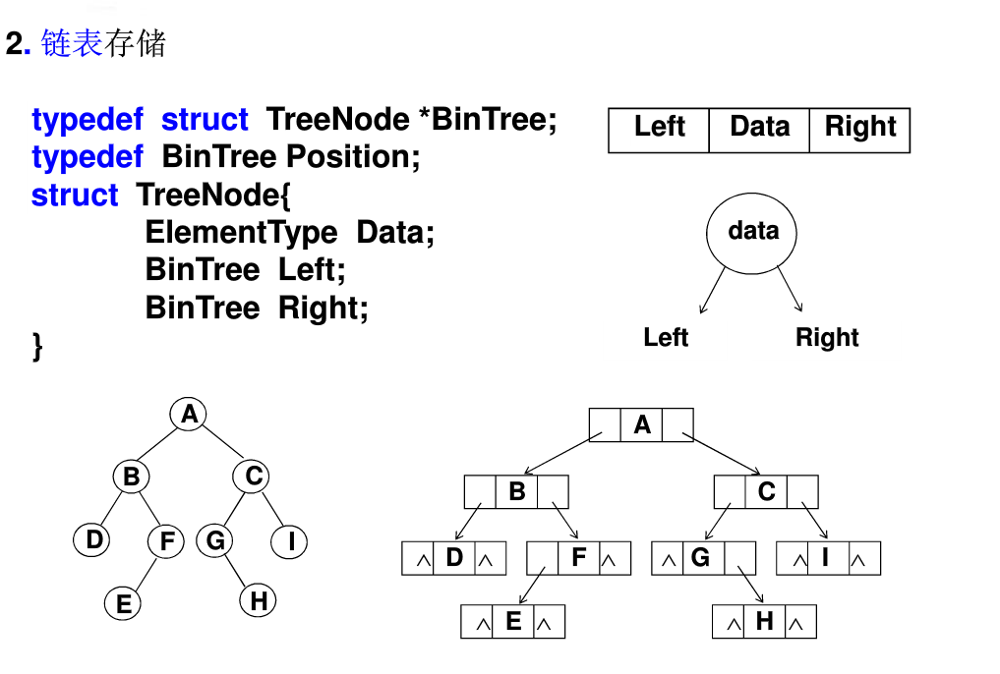

## 二叉树的遍历

先序遍历、中序、后序、层序。

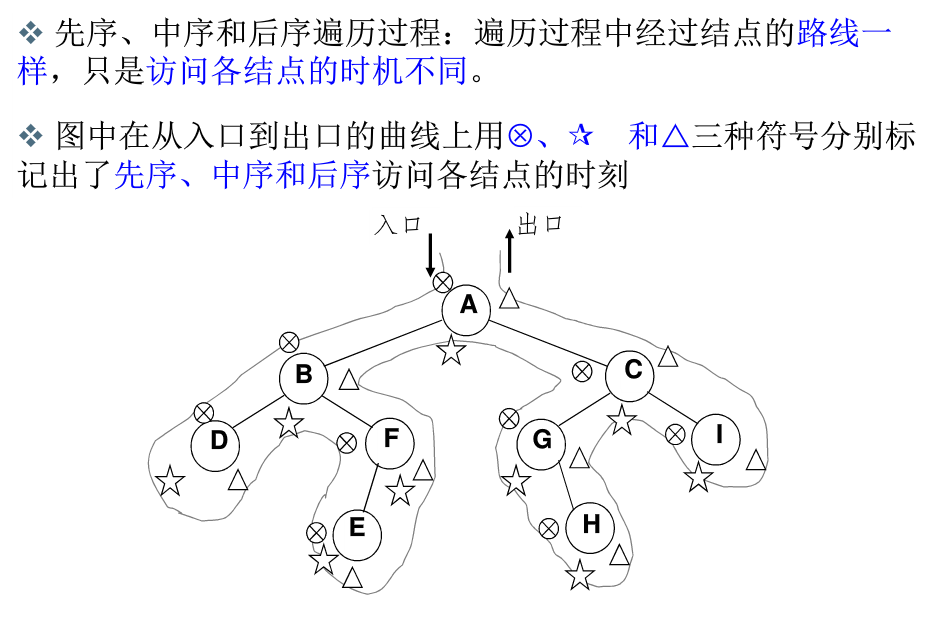

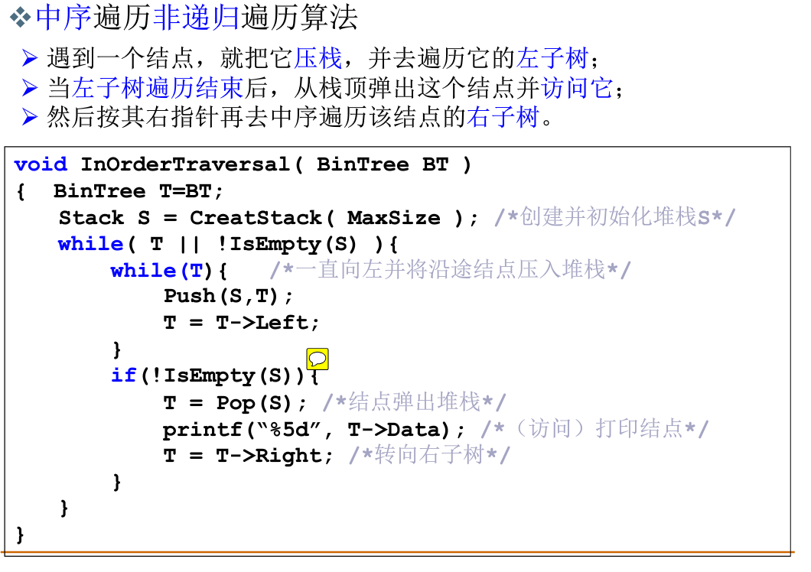

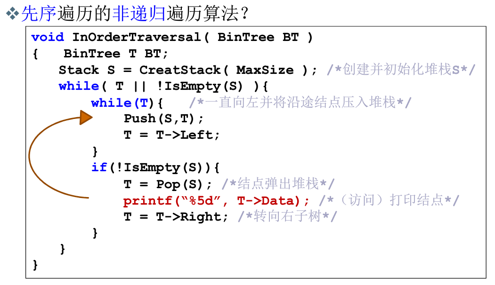

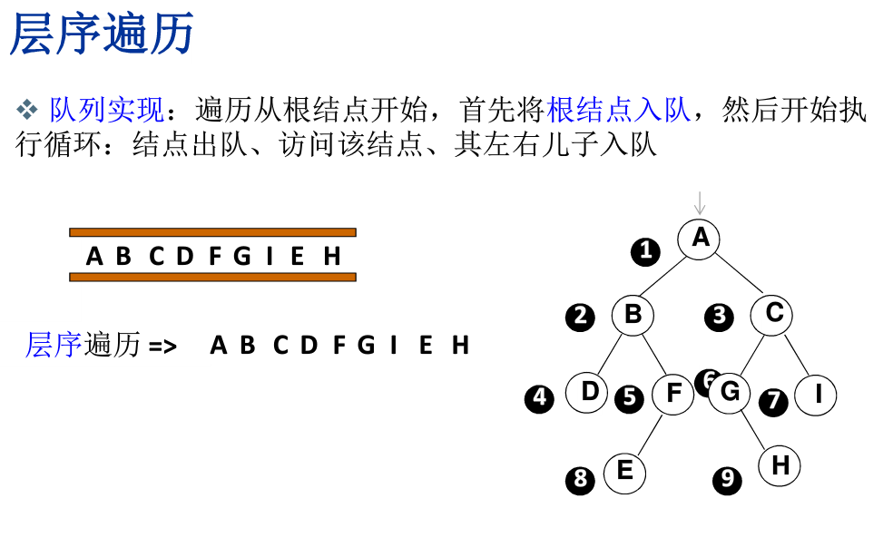

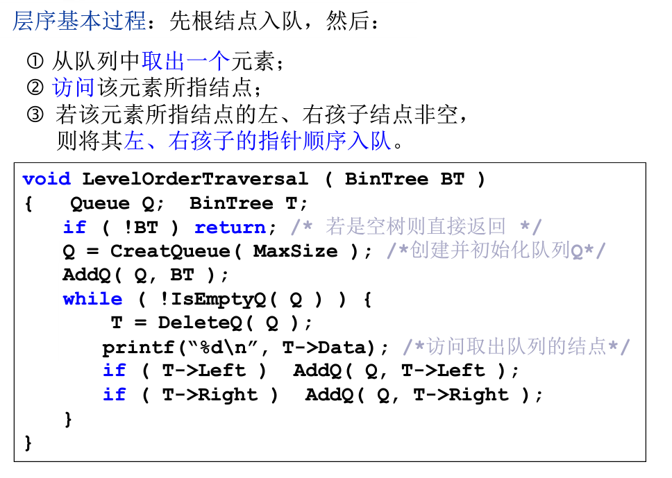